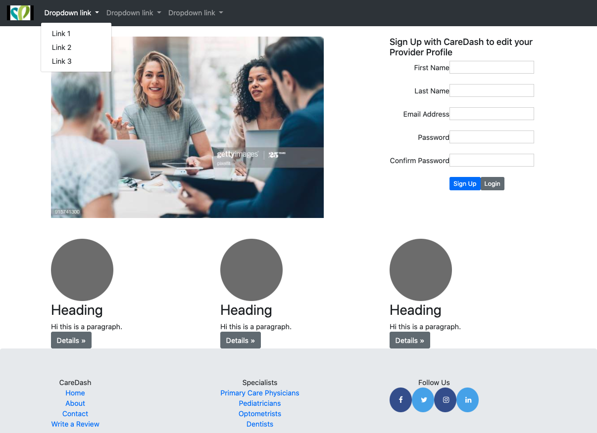
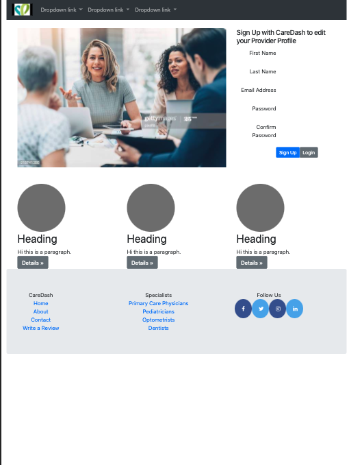

# CareDash Frontend 
#### Developed by Anooj Shah

## Project Directory
`index.html` contains the main html file.
The styles are in the styles directory

## How to Run 
This is a static page, so it can be seen locally by opening the html file on a web browser.

## Design Considerations
The Navbar particularly is quite responsive as it adjusts to a drop down navbar in smaller screen sizes (phones). This allows for a better mobile-like feel to the application when viewed on a smaller device. 

## Responsive Views
Desktop View (large screen): 
 
Table View: 
 
Mobile View: 
 
